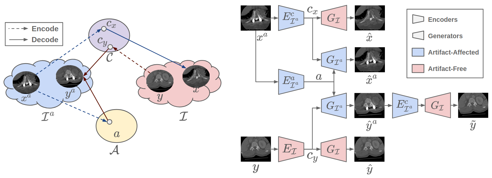

# ADN: Artifact Disentanglement Network for Unsupervised Metal Artifact Reduction [[Paper]](https://arxiv.org/pdf/1908.01104.pdf)

By [Haofu Liao](http://www.liaohaofu.com) (liaohaofu@gmail.com), Spring, 2019



## Citation

If you use this code for your research, please cite our paper.

```latex
@inproceedings{adn2019_miccai,
  title={Artifact Disentanglement Network for Unsupervised Metal Artifact Reduction},
  author={Haofu Liao, Wei-An Lin, Jianbo Yuan, S. Kevin Zhou, Jiebo Luo},
  booktitle={International Conference on Medical Image Computing and Computer-Assisted Intervention (MICCAI)},
  year={2019}
}
@article{adn2019_tmi, 
  author={H. {Liao} and W. {Lin} and S. K. {Zhou} and J. {Luo}}, 
  journal={IEEE Transactions on Medical Imaging}, 
  title={ADN: Artifact Disentanglement Network for Unsupervised Metal Artifact Reduction}, 
  year={2019},
  doi={10.1109/TMI.2019.2933425}
}
```

## Prerequisites

This repository is tested under the following system settings:

- Ubuntu 16.04
- Python 3.7 (Anaconda/Miniconda reconmmended)
- Pytorch 1.0.0 or above
- CUDA 9.0 or above
- Matlab R2018b (with Image Processing Toolbox, Parallel Computing Toolbox and Statistics and Machine Learning Toolbox)

## Install

### Local

For most of the users, you may consider install ADN locally on your machine with the following steps.

- Clone this repository from Github

```cmd
git clone https://github.com/liaohaofu/adn.git
```

- Install [Pytorch](https://pytorch.org/get-started/locally/) and [Anaconda](https://www.anaconda.com/distribution/#download-section)/[Miniconda](https://docs.conda.io/en/latest/miniconda.html)
  - Anaconda/Miniconda installation is optional. If not installed, you may have to install some dependent python packages manually.
- Install Python dependencies.

```cmd
pip install -r requirements.txt
```

### Docker

For Docker users, we provide a pre-built docker image as well as a Dockerfile.

- Install [docker-ce](https://docs.docker.com/install/) and [nvidia-docker](https://github.com/NVIDIA/nvidia-docker).
- Pull the ADN docker image from Docker Hub. This will install ADN as well as its dependencies automatically.

```cmd
docker pull liaohaofu/adn
```

- **[Optional]** If you want a customized version of ADN docker image, you may modify the docker file at `docker/Dockerfile` and then build a docker image.

```cmd
cd docker/
docker build -t liaohaofu/adn .
```

- Run the ADN docker image.

```cmd
docker run -it --runtime=nvidia liaohaofu/adn
```

## Datasets

Two publicly available datasets (DeepLesion and Spineweb) are supported. As a courtesy, we also support training/testing with natural images.

### DeepLesion

- Download the [DeepLesion dataset](https://nihcc.app.box.com/v/DeepLesion). We use the first 9 *.zip* files (Images_png_01.zip to Images_png_09.zip) in our experiments. You may use the `batch_download_zips.py` provided by DeepLesion to batch download the *.zip* files at once.
- Extract the downloaded *.zip* files. All the extracted images will be under the folder `path_to_DeepLesion/Images_png/`. Here `path_to_DeepLesion` is the folder path where you extract the *.zip* files.
- Create a softlink to DeepLesion. **Replace `path_to_DeepLesion/Images_png` to the actual path in your system before running the following command**.

```cmd
ln -s path_to_DeepLesion/Images_png data/deep_lesion/raw
```

- Prepare DeepLesion dataset for ADN (**MATLAB required**). The configuration file for preparing DeepLesion dataset can be found at `config/dataset.yaml`.

```matlab
>> prepare_deep_lesion
```

### Spineweb

- Download the [Spineweb dataset](https://imperialcollegelondon.app.box.com/s/erhcm28aablpy1725lt93xh6pk31ply1).
- Extract the *spine-\*.zip* files (i.e., `spine-1.zip`, `spine-2.zip`, etc.).  All the extracted images will be under the folder `path_to_Spineweb/spine-*/`. Here `path_to_Spineweb` is the folder path where you extract the *spine-\*.zip* files.
- Create a softlink to Spineweb. **Replace `path_to_Spineweb/` to the actual path to in your system before running the following command**.

```cmd
mkdir data/spineweb
ln -s path_to_Spineweb/ data/spineweb/raw
```

- Prepare Spineweb dataset for ADN. The configuration file for preparing Spineweb dataset can be found at `config/dataset.yaml`.

```cmd
python prepare_spineweb.py
```

### Natural image

- Our code assumes you have prepared your natural image dataset as following.

```cmd
your_dataset
├── test
│   ├── artifact # a folder containing all the testing images with artifact
│   └── no_artifact # a folder containing all the testing images without artifact
└── train
    ├── artifact # a folder containing all the training images with artifact
    └── no_artifact # a folder containing all the training images without artifact
```

- Create a softlink to your natural image dataset

```cmd
ln -s path_to_your_dataset data/nature_image
```

- **Note that our model is not tuned for natural images (e.g., choices of loss functions, hyperparameters, etc.) and its effectiveness may vary depending on the problems and datasets.**

## Demo

- We provide a demo code to demonstrate the effectiveness of ADN. The input sample images are located at `samples/` and the outputs of the demo can be found at `results/`. To run the demo,

```cmd
python demo.py deep_lesion
python demo.py spineweb
```

- **[Optional]** By default, the demo code will download pretrained models from google drive automatically. If the downloading fails, you may download them from google drive manually.
  - Download pretrained models from Google Drive ([DeepLesion](https://drive.google.com/open?id=1NqZtEDGMNemy5mWyzTU-6vIAVIk_Ht-N) | [Spineweb](https://drive.google.com/open?id=1eF-6YTJYlVa7fVMk8n9yQssAqzrhLO1T)) or [Bitbucket](https://bitbucket.org/liaohaofu/adn_modesl).
  - Move the downloaded models to `runs/`.

  ```cmd
  mv path_to_DeepLesion_model runs/deep_lesion/deep_lesion_49.pt
  mv path_to_Spineweb_model runs/spineweb/spineweb_39.pt
  ```

## Train and Test

- Configure the training and testing. We use a two-stage configuration for ADN, one for the default settings and the other for the run settings.
  - The default settings of ADN can be found at `config/adn.yaml` which is not subject to be changed. When users do not provide the values for a specific setting, the default setting in this file will be used.
  - The run settings can be found at `runs/adn.yaml`. This is where the users provide specific settings for ADN's training and testing. Any provided settings in this file will override the default settings during the experiments. **By default, the settings for training and testing ADN with DeepLesion, Spineweb and natural image datasets are provided in** `runs/adn.yaml`.

- Train ADN with DeepLesion, Spineweb datasets or a natural image dataset. The training results (model checkpoints, configs, losses, training visualizations, etc.) can be found under `runs/run_name/` where `run_name` can be either `deep_lesion`, `spineweb` or `nature_image`

```cmd
python train.py deep_lesion
python train.py spineweb
python train.py nature_image
```

- Test ADN with DeepLesion, Spineweb datasets or a natural image dataset. The testing results (evaluation metrics and testing visualizations, etc.) can be found under `runs/run_name/` where `run_name` can be either `deep_lesion`, `spineweb` or `nature_image`.

```cmd
python test.py deep_lesion
python test.py spineweb
python test.py nature_image
```

## Acknowledgement

The authors would like to thank Dr. Yanbo Zhang (yanbozhang007@gmail.com) and Dr. Hengyong Yu (hengyong_yu@uml.edu) for providing the artifact synthesis code used in this repository.
